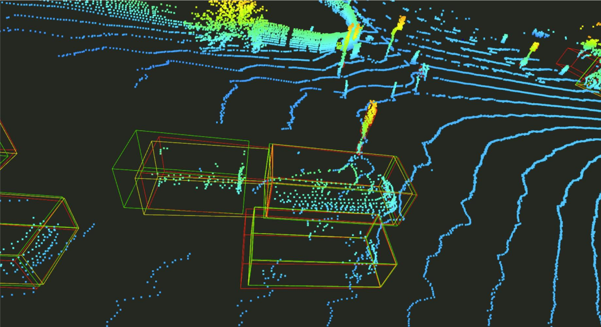

# Installation

### Requirements

- Linux
- Python 3.6+
- PyTorch 1.1 or higher
- CUDA 10.0 or higher
- CMake 3.13.2 or higher
- spconv

### Environment


#### New version (Stable now)
```shell
conda create --name 3dal_pytorch python=3.7
conda activate 3dal_pytorch
conda install pytorch==1.10.1 torchvision==0.11.2 torchaudio==0.10.1 cudatoolkit=11.3 -c pytorch -c conda-forge
pip install -r requirements.txt
pip install waymo-open-dataset-tf-1-15-0==1.2.0

# Add 3dal_pytorch to PYTHONPATH by adding the following line to ~/.bashrc (change the path accordingly)
export PYTHONPATH="${PYTHONPATH}:PATH_TO_THIS_REPO"
export PYTHONPATH="${PYTHONPATH}:PATH_TO_THIS_REPO/frustum_pointnets_pytorch"


# Set the cuda path (change the path to your own cuda location)
export PATH=/usr/local/cuda-11.1/bin:$PATH
export CUDA_PATH=/usr/local/cuda-11.1
export CUDA_HOME=/usr/local/cuda-11.1
export LD_LIBRARY_PATH=/usr/local/cuda-11.1/lib64:$LD_LIBRARY_PATH

# Rotated NMS 
cd 3dal_pytorch/det3d/ops/iou3d_nms
python setup.py build_ext --inplace

# spconv
pip install spconv-cu111

# OpenPCDet
git clone https://github.com/open-mmlab/OpenPCDet.git
cd OpenPCDet
python setup.py develop

# APEX (Optional)
git clone https://github.com/NVIDIA/apex
cd apex
pip install -v --no-cache-dir --global-option="--cpp_ext" --global-option="--cuda_ext" ./

pip install open3d
```

#### Old version (Stable)
```shell
conda create --name 3dal_pytorch python=3.6
conda activate 3dal_pytorch
conda install pytorch==1.1.0 torchvision==0.3.0 cudatoolkit=10.0 -c pytorch
pip install -r requirements.txt
pip install waymo-open-dataset-tf-1-15-0==1.2.0

# Add 3dal_pytorch to PYTHONPATH by adding the following line to ~/.bashrc (change the path accordingly)
export PYTHONPATH="${PYTHONPATH}:PATH_TO_THIS_REPO"
export PYTHONPATH="${PYTHONPATH}:PATH_TO_THIS_REPO/frustum_pointnets_pytorch"


# Set the cuda path (change the path to your own cuda location)
export PATH=/usr/local/cuda-10.0/bin:$PATH
export CUDA_PATH=/usr/local/cuda-10.0
export CUDA_HOME=/usr/local/cuda-10.0
export LD_LIBRARY_PATH=/usr/local/cuda-10.0/lib64:$LD_LIBRARY_PATH

# Rotated NMS 
cd 3dal_pytorch/det3d/ops/iou3d_nms
python setup.py build_ext --inplace

# Deformable Convolution (Optional and only works with old torch versions e.g. 1.1)
cd 3dal_pytorch/det3d/ops/dcn
python setup.py build_ext --inplace

# spconv
git clone https://github.com/traveller59/spconv.git --recursive
cd spconv && git checkout 7342772
python setup.py bdist_wheel
cd ./dist && pip install *

# OpenPCDet
git clone https://github.com/open-mmlab/OpenPCDet.git
cd OpenPCDet
python setup.py develop

# APEX (Optional)
git clone https://github.com/NVIDIA/apex
cd apex
git checkout 5633f6  # recent commit doesn't build in our system 
pip install -v --no-cache-dir --global-option="--cpp_ext" --global-option="--cuda_ext" ./

pip install open3d
```

### Data preparation

#### 1. Download the data from [here](https://waymo.com/open/licensing/) and organize as follows.

```
WAYMO_DATASET_ROOT
  ├── tfrecord_training
  ├── tfrecord_validation
  └── tfrecord_testing
```

#### 2. Convert the tfrecord data to pickle files.

```shell
# Train set
CUDA_VISIBLE_DEVICES=-1 python det3d/datasets/waymo/waymo_converter.py --record_path 'WAYMO_DATASET_ROOT/tfrecord_training/*.tfrecord' --root_path 'WAYMO_DATASET_ROOT/train/'

# Validation set 
CUDA_VISIBLE_DEVICES=-1 python det3d/datasets/waymo/waymo_converter.py --record_path 'WAYMO_DATASET_ROOT/tfrecord_validation/*.tfrecord' --root_path 'WAYMO_DATASET_ROOT/val/'

# Testing set 
CUDA_VISIBLE_DEVICES=-1 python det3d/datasets/waymo/waymo_converter.py --record_path 'WAYMO_DATASET_ROOT/tfrecord_testing/*.tfrecord' --root_path 'WAYMO_DATASET_ROOT/test/'
```

#### 3. Create a symlink to the dataset root.

```shell
# Remember to change the WAYMO_DATASET_ROOT to the actual path in your system.
mkdir data && cd data
ln -s WAYMO_DATASET_ROOT Waymo
```

#### 4. Create info files.

```shell
python tools/create_data.py waymo_data_prep --root_path=data/Waymo --split train --nsweeps=2
python tools/create_data.py waymo_data_prep --root_path=data/Waymo --split val --nsweeps=2
python tools/create_data.py waymo_data_prep --root_path=data/Waymo --split test --nsweeps=2
```

#### 5. The data and info files should be organized as follows.

```
3dal_pytorch
  └── data
    └── Waymo
      ├── tfrecord_training
      ├── tfrecord_validation
      ├── train <-- all training frames and annotations
      ├── val   <-- all validation frames and annotations
      ├── test   <-- all testing frames and annotations
      ├── infos_train_02sweeps_filter_zero_gt.pkl
      ├── infos_val_02sweeps_filter_zero_gt.pkl
      └── infos_test_02sweeps_filter_zero_gt.pkl
```

### Getting Started with 3DAL

#### 1. 3D object detection

```shell
python tools/dist_test.py configs/waymo/voxelnet/two_stage/waymo_centerpoint_voxelnet_two_sweep_two_stage_bev_5point_ft_6epoch_freeze_with_vel.py --work_dir work_dirs/${work_dir}/[train, val] --checkpoint work_dirs/${work_dir}/epoch_6.pth --speed_test
```

#### 2. 3D multi-object tracking

```shell
python3 tools/waymo_tracking/test.py --work_dir work_dirs/${work_dir}/[train, val] --checkpoint work_dirs/${work_dir}/[train, val]/prediction.pkl --info_path data/Waymo/infos_[train, val]_02sweeps_filter_zero_gt.pkl
```

#### 3. Object track data extraction

```shell
python3 tools/trackData.py --work_dir work_dirs/${work_dir}/[train, val]
```
#### 4 Get tracking groundtruth
```shell
python3 tools/trackGT.py --infos data/Waymo/infos_[train, val]_02sweeps_filter_zero_gt.pkl --result work_dirs/${work_dir}/[train, val]/trackGT.pkl
```

#### 5. Motion state classification

```shell
python3 tools/motionState.py --track_train work_dirs/${work_dir}/train --track_val work_dirs/${work_dir}/val
```

#### 6. Static object auto-labeling

##### Train

```shell
python3 tools/static_train.py --track work_dirs/${work_dir}/train/trackStatic.pkl --infos data/Waymo/infos_train_02sweeps_filter_zero_gt.pkl --model_type two_box_est
```

##### Evaluation
###### Performance before training
```shell
python3 tools/static_init.py --track work_dirs/${work_dir}/val/trackStatic.pkl --infos data/Waymo/infos_val_02sweeps_filter_zero_gt.pkl --det_annos work_dirs/${work_dir}/val/det_annos.pkl
```
###### Performance after training
```shell
python3 tools/static_eval.py --track work_dirs/${work_dir}/val/trackStatic.pkl --infos data/Waymo/infos_val_02sweeps_filter_zero_gt.pkl --model_path work_dirs/${work_dir}/train/static/model/one_box_est/acc0.856392_best.pth --model_type one_box_est --det_annos work_dirs/${work_dir}/val/det_annos.pkl
```
This will also output the 2D/3D IoU and 3D Acc@0.7 metrics

#### 7. Dynamic object auto-labeling

##### Train

```shell
python3 tools/dynamic_train.py --track work_dirs/${work_dir}/train/trackDynamic.pkl --infos data/Waymo/infos_train_02sweeps_filter_zero_gt.pkl
```

##### Evaluation
###### Performance before training
```shell
python3 tools/dynamic_init.py --track work_dirs/${work_dir}/val/trackDynamic.pkl --infos data/Waymo/infos_val_02sweeps_filter_zero_gt.pkl
```
###### Performance after training
```shell
python3 tools/dynamic_eval.py --track work_dirs/${work_dir}/val/trackDynamic.pkl --infos data/Waymo/infos_val_02sweeps_filter_zero_gt.pkl --model_path work_dirs/${work_dir}/train/dynamic/model/acc0.856392_best.pth --model_type one_box_est --det_annos work_dirs/${work_dir}/val/det_annos.pkl
```
This will also output the 2D/3D IoU and 3D Acc@0.7 metrics

### Visualization

```shell
python vis_ptcld.py --infos waymo/infos_val_02sweeps_filter_zero_gt.pkl --lidar waymo/seq_0_frame_0/lidar.pkl --annos waymo/seq_0_frame_0/annos.pkl --pred1 waymo/prediction.pkl --pred2 waymo/one_box_est.pkl --token seq_0_frame_0.pkl
```
**Still not working now**

> Red: groundtruth | Green: w/o temporal | Yellow: w/ temporal




### Convert to Bat-3d format
```shell
python tools/bat_3d_converter/waymo_to_bat3d.py --waymo_dir ${root_dir_of_waymo_data} --output_dir ${output_dir} 
```

#### Convert only a spcefic sequence
```shell
python tools/bat_3d_converter/waymo_to_bat3d.py --waymo_dir ${root_dir_of_waymo_data} --output_dir ${output_dir} --seq_num 0
```

### Acknowledgement

- [CenterPoint](https://github.com/tianweiy/CenterPoint)

